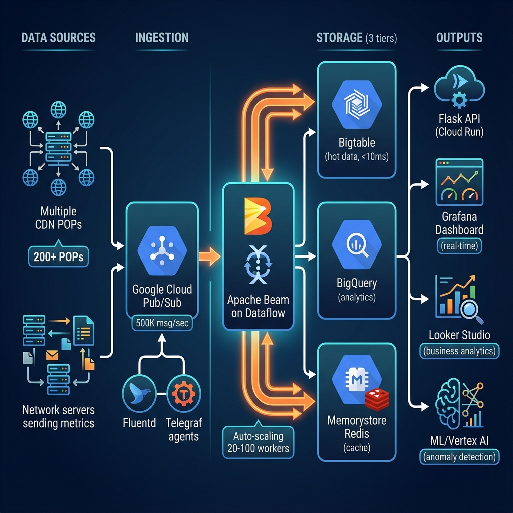

# CDN Analytics Platform - Big Data Solution

## 📋 Vue d'ensemble

Plateforme d'analytics Big Data pour opérateur CDN/Télécom traitant **5 TB/jour** de données de télémétrie réseau en **near real-time** sur Google Cloud Platform.

### Cas d'usage
- Routage intelligent basé sur performance temps réel
- Monitoring QoS et détection d'anomalies
- Analytics business et optimisation capacité
- Dashboards temps réel pour Network Operations Center (NOC)

### Architecture



- **Ingestion**: Pub/Sub (500K+ msg/sec)
- **ETL**: Apache Beam sur Dataflow (20-100 workers auto-scaling)
- **Stockage**: Bigtable (hot data) + BigQuery (analytics) + Memorystore (cache)
- **ML**: BigQuery ML + Vertex AI
- **Viz**: Grafana (temps réel) + Looker Studio (business)
- **API**: Flask sur GKE (routage intelligent)

## 🚀 Quick Start

### Prérequis
- Google Cloud Platform account avec billing activé
- Terraform >= 1.5
- Python 3.11+
- gcloud CLI configuré

### Installation

```bash
# 1. Clone et setup
cd cdn-analytics-platform
python -m venv venv
source venv/bin/activate  # ou venv\Scripts\activate sur Windows
pip install -r requirements.txt

# 2. Configuration GCP
export GCP_PROJECT_ID="votre-projet-id"
export GCP_REGION="europe-west1"
gcloud config set project $GCP_PROJECT_ID

# 3. Déploiement infrastructure
cd infrastructure/terraform
terraform init
terraform plan -var-file=../environments/prod.tfvars
terraform apply -var-file=../environments/prod.tfvars

# 4. Déploiement pipelines Dataflow
python pipelines/dataflow/enrichment_pipeline.py \
  --runner=DataflowRunner \
  --project=$GCP_PROJECT_ID \
  --region=$GCP_REGION

# 5. Déploiement API
cd api
docker build -t gcr.io/$GCP_PROJECT_ID/routing-api:latest .
docker push gcr.io/$GCP_PROJECT_ID/routing-api:latest
kubectl apply -f k8s/
```

## 📁 Structure du projet

```
cdn-analytics-platform/
├── infrastructure/          # Infrastructure as Code
│   ├── terraform/          # Configuration Terraform
│   └── environments/       # Variables par environnement
├── ingestion/              # Agents de collecte
│   ├── fluentd/           # Config Fluentd (logs CDN)
│   └── telegraf/          # Config Telegraf (métriques réseau)
├── pipelines/              # Pipelines de traitement
│   └── dataflow/          # Jobs Apache Beam
├── sql/                    # Requêtes et modèles SQL
│   ├── materialized_views/ # Vues matérialisées BigQuery
│   └── ml_models/         # Modèles BigQuery ML
├── ml/                     # Machine Learning
│   └── anomaly_detection/ # Détection d'anomalies Vertex AI
├── api/                    # API de routage intelligent
├── dashboards/             # Dashboards et visualisation
│   ├── grafana/           # Dashboards temps réel
│   └── looker/            # Rapports business
├── tests/                  # Tests unitaires et intégration
└── docs/                   # Documentation

```

## 🎯 Métriques de Performance

| Métrique | Valeur cible | Amélioration |
|----------|--------------|--------------|
| Latence ingestion | < 30 sec | 90%+ |
| Query latency | < 5 sec | 85%+ |
| Dashboard load | < 2 sec | 90%+ |
| API response time | < 50 ms P95 | 80%+ |
| Coût par TB | < $3 | 50%+ |

## 💰 Coûts estimés

- **Production (5 TB/jour)**: ~$13,000/mois (avec optimisations)
- Détails: voir [docs/cost_analysis.md](docs/cost_analysis.md)

## 📚 Documentation

- [Architecture détaillée](docs/architecture.md)
- [Guide de déploiement](docs/deployment.md)
- [Optimisations performance](docs/performance.md)
- [Monitoring et alerting](docs/monitoring.md)
- [Troubleshooting](docs/troubleshooting.md)

## 🔐 Sécurité

- Service accounts avec moindres privilèges
- VPC peering pour communication inter-services
- Chiffrement au repos (BigQuery, Bigtable, GCS)
- Secrets dans Secret Manager
- Audit logs activés

## 📈 Roadmap

- [x] Phase 1: Fondations infrastructure
- [x] Phase 2: Traitement avancé
- [x] Phase 3: ML & Analytics
- [x] Phase 4: Production & Optimisation
- [ ] Phase 5: Multi-cloud (AWS/Azure)
- [ ] Phase 6: Edge computing integration

## 🤝 Contribution

Voir [CONTRIBUTING.md](CONTRIBUTING.md)

## 📄 License

MIT License - voir [LICENSE](LICENSE)

## 👥 Équipe

Développé pour résoudre les problèmes de performance d'analytics CDN/Télécom à grande échelle.
